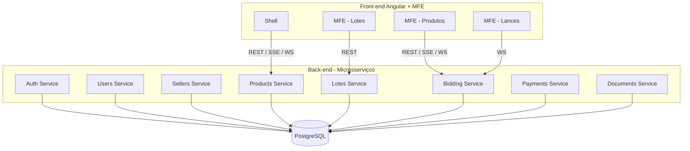

# Cenário Técnico: Comunicação Direta Front-end <-> Back-end (Sem API Gateways e Sem BFF)

## 1. Visão Geral

Este documento descreve o cenário técnico para um sistema de leilão eletrônico **sem API Gateway** e **sem Backend-for-Frontend (BFF)**, onde a comunicação ocorre de forma direta entre:

**Front-end (Angular 18/Micro-Frontends)** ⟷ **Back-end (Microserviços Java 21/Spring Boot 3)**

O foco é avaliar impactos, benefícios, limitações e como implementar o fluxo de lances em tempo real (real-time bidding) neste modelo simplificado.

---

## 2. Arquitetura Geral do Cenário

### 2.1 Fluxo de Comunicação

```
Browser (Angular MFE)
        ⟷
Microserviços Spring Boot (Java 21)
```

Não há camadas intermediárias. Cada aplicação MFE se comunica diretamente com os endpoints necessários.

### 2.2 Componentes Envolvidos

* **Front-end MFE (Angular 18+)**

  * Shell container
  * Micro-frontends para: catálogo, lotes, produtos, lances, painel do vendedor, área administrativa

* **Back-end (Java 21 + Spring Boot 3)**

  * Microserviço de autenticação e identidade
  * Microserviço de usuários
  * Microserviço de vendedores
  * Microserviço de produtos
  * Microserviço de lotes
  * Microserviço de lances / real-time
  * Microserviço de pagamentos
  * Microserviço de documentos e notificações

* **Banco**: PostgreSQL

---

## 3. Características deste Modelo

### 3.1 Benefícios

1. **Menor latência** (comunicação direta sem hops intermediários).
2. **Menor custo operacional** (sem gateways, sem BFF, menos serviços para manter).
3. **Menor complexidade inicial** → ideal para MVP.
4. **Menor dependência de times especializados em infraestrutura e API management**.
5. **Menos configurações de rede** (DNS, rotas e segurança são mais simples).

### 3.2 Desvantagens

1. **Aumento do acoplamento front-end ↔ microserviços**.
2. **Back-end exposto diretamente à internet** — maior carga e maior superfície de ataque.
3. **Sem agregação ou composição de dados** → o front precisará:

   * Fazer várias chamadas paralelas;
   * Remontar dados;
   * Implementar lógica duplicada.
4. **Dificuldade futura para escalar funcionalidades individuais do front**.
5. **Crescimento do número de chamadas por página**.
6. **Versionamento mais difícil** — o front precisa se adaptar diretamente a mudanças nos microserviços.

---

## 4. Implementação de Realtime Sem Gateways e Sem BFF

### 4.1 Opção 1 – SSE (Server-Sent Events)

**Vantagens:**

* Simples de implementar.
* Back-end envia os eventos diretamente ao navegador.
* Não exige bibliotecas no cliente.
* Ideal para cenários de broadcast unidirecional.

**Desvantagens:**

* Não suporta comunicação bidirecional.
* Se o serviço estiver replicado em cluster, é necessário:

  * Sticky sessions **ou**
  * Um message broker para fan-out dos eventos.

**Cenários adequados:**

* Usuários apenas observando o leilão.
* Atualização de preço e contagem regressiva.

### 4.2 Opção 2 – WebSockets

**Vantagens:**

* Bidirecional.
* Melhor para usuários ativos dando lances.
* Permite confirmação de recebimento, prioridade, throttling.

**Desvantagens sem gateway ou BFF:**

* O front conecta diretamente aos microserviços WebSocket.
* Complexidade de roteamento aumenta (cada microserviço pode ter seu próprio WebSocket endpoint).
* Em cluster, exige sticky sessions ou redis pub/sub.

### 4.3 Modelo Híbrido Recomendado

| Situação                                    | Tecnologia sugerida | Racional                              |
| ------------------------------------------- | ------------------- | ------------------------------------- |
| Usuário apenas observando lances            | **SSE**             | Mais leve e simples                   |
| Usuário pronto para lançar (intenção ativa) | **WebSocket**       | Confirmações rápidas e baixa latência |
| Fluxos administrativos                      | **REST**            | Não precisam de realtime              |

---

## 5. Autenticação e Segurança sem Gateways

Com o back-end exposto diretamente ao front-end, recomenda-se:

### 5.1 Tokens JWT (Access Tokens)

* Assinados com RSA.
* Curta duração.
* Renovação via Refresh Token seguro.

### 5.2 Rate Limiting no Back-end

Como não existe API Gateway, o próprio Spring Boot deve aplicar:

* Bucket4j
* Resilience4j

### 5.3 Proteção CORS

Como a API é pública, configurar CORS com:

* Origem específica do front
* Apenas métodos permitidos

### 5.4 TLS direto no serviço (ACM não é possível sem gateway)

A aplicação deverá usar:

* Certificados gerenciados manualmente (Let’s Encrypt) **ou**
* Terminação TLS no Load Balancer da AWS (recomendado)

---

## 6. Desenho Técnico (Mermaid)

### 6.1 Arquitetura Geral Sem Gateways



---

## 7. Estratégia de Infraestrutura AWS Sem Gateways

### 7.1 Serviços recomendados

* **EC2 ou ECS Fargate** para microserviços
* **ALB (Application Load Balancer)**

  * Roteamento simples para cada microserviço
  * Terminação HTTPS
* **RDS PostgreSQL**
* **S3** para documentos
* **CloudFront (opcional)** para front-end

### 7.2 Observações

* O ALB substitui o papel mínimo de um API Gateway basicão.
* Não há BFF para normalizar dados ou juntar múltiplas chamadas.
* O front deve armazenar as URLs dos serviços no environment.

---

## 8. Considerações para o Fluxo de Lances (Crítico)

### Sem BFF e sem Gateway, o front precisa:

* Abrir uma conexão SSE **diretamente no Bidding Service** para receber eventos.
* Abrir WebSocket **diretamente no Bidding Service** para enviar lances.
* Enviar o lance via REST como fallback.

### O Bidding Service deve:

1. Processar lances com baixa latência.
2. Arbitrar o vencedor e rejeitar duplicados.
3. Broadcast dos eventos por:

   * **Redis pub/sub** (no cluster)
   * Ou **in-memory** (sem cluster)
4. Notificar usuários via SSE.
5. Confirmar lances via WebSocket.

---

## 9. Conclusão

O cenário **sem API Gateway e sem BFF** é totalmente viável, especialmente para um MVP de baixo custo. Porém:

* a complexidade desloca-se para o front-end;
* expõe os microserviços à internet pública;
* exige cuidados maiores com segurança e versionamento;
* aumenta o acoplamento do front aos serviços;
* exige uma solução robusta de realtime dentro dos próprios serviços.

Para MVP: **é uma opção válida e econômica**.
Para crescimento e escala: **migrar para um modelo com BFF + API Gateway será inevitável**.
